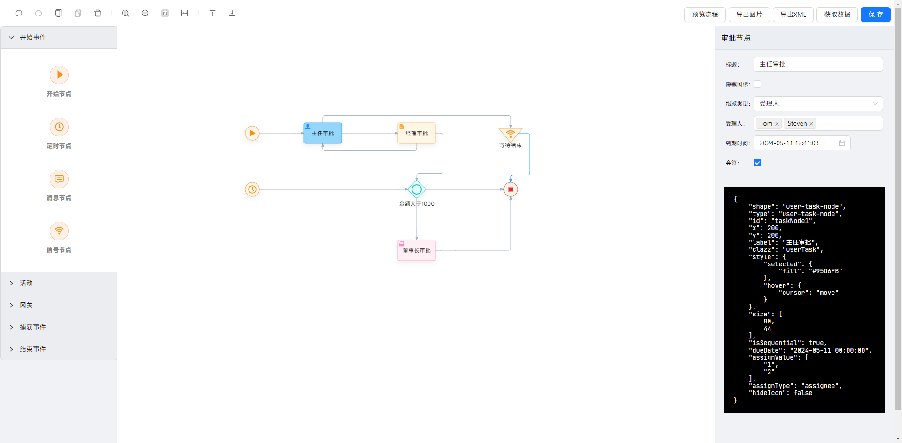

# Workflow Designer for Vue3

[](https://www.npmjs.org/package/wfd-vue)
[](https://www.npmjs.org/package/wfd-vue)
[](https://github.com/HanawaHinata/wfd-vue3/blob/main/LICENSE)

本项目基于 https://github.com/guozhaolong/wfd-vue 开发，大部分代码拷贝自此项目，并根据 @antv/g6 的更新版本及 Vue3 进行修改，目前简单功能已实现可用，但还有大量工作需要做。

就目前来说，本项目正处于测试阶段，且本人能力有限，项目代码会有很多问题，敬告各位请勿将本项目用于生产环境。



与原项目相比，本项目做了如下改变：

* 本项目基于~~微优易~~ Vue3 开发，组件使用组合式 API 编写；
* 本项目使用 `Ant Design Vue 4.x` 作为框架，而非 `Element UI`；
* 本项目使用 `Less` 实现样式；
* 稍微改变了下项目结构。将大部分 js 文件移到 `utils` 目录下；没有使用 `example` 目录做示例而是直接使用 `App.vue`（感觉也没太大影响，如果后期考虑上 npm 的话会修改下）。

## 项目开发相关指令
本项目使用 `yarn` 控制和管理依赖。

### 初始化依赖
```
yarn install
```

### 开发模式热更新运行
```
yarn serve
```

### 发布生产环境版本
```
yarn build
```

### 客制化配置
请参阅 [Vue Cli 配置项手册](https://cli.vuejs.org/config/).


## 引入使用
```
<template>
  <div id="app">
    <wfd-vue
      ref="wfdRefs"
      :data="demoData"
      :height="600"
      :users="candidateUsers"
      :groups="candidateGroups"
      :categories="categories"
      :lang="lang"
    >
        <!-- 顶栏右侧按钮插槽内容 -->
    </wfd-vue>
  </div>
</template>

<script setup>
  import {ref} from 'vue'
  import WfdVue from 'wfd-vue'

  const wfdRefs = ref()

  const demoData = ref({...})
  const candidateUsers = ref([...])
  const candidateGroups = ref([...])
  const categories = ref([...])

  /**
   * 语言
   */
  const lang = ref("zh")
</script>
```
## API
### 属性
* `data`: 初始化数据
* `height`: 画布高度
* `mode`: `view`为只读，`edit`为可编辑
* `lang`: 本项目支持多语言。语言`zh`为中文，`en`为英文
* `isView`: 是否为预览模式（隐藏工具栏和属性栏）
* `users`: 选择审批人时对应的数据，数组内对象以`id`为键，`name`为值
* `groups`: 选择审批组时对应的数据，数组内对象以`id`为键，`name`为值
* `categories`: 选择分类时对应的数据，数组内对象以`id`为键，`name`为值

### 方法
* `getGraphData()`: 调用 `graph.save()` 生成 json。
* `getXML()`: 调用 `graph.saveXML(createFile)` 生成 Flowable XML，只返回 XML 字符串但不生成文件下载。
* `saveXML()`: 调用 `graph.saveXML(createFile)` 生成 Flowable XML 文件，并发起下载。
* `saveImg(createFile)`: 调用 `graph.saveImg(createFile)` 生成图片，`createFile` 参数表示是否生成图片文件，默认为 `true` ，该函数返回值为图片 base64 。

## 友情链接
[flowable 流程设计器](https://github.com/GoldSubmarine/workflow-bpmn-modeler)，感谢 @GoldSubmarine 提供。

本项目基于 @guozhaolong 的[辛勤工作](https://github.com/guozhaolong/wfd-vue)，感谢作者开发此项目为我们的工作带来便利。

## License
本项目基于 `Apache License V2.0` 自由分发，请尽情使用并享受开源。
